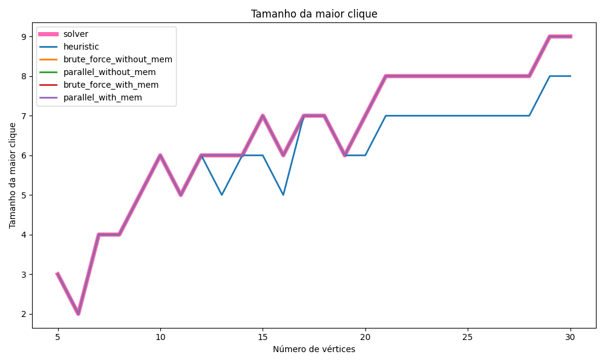
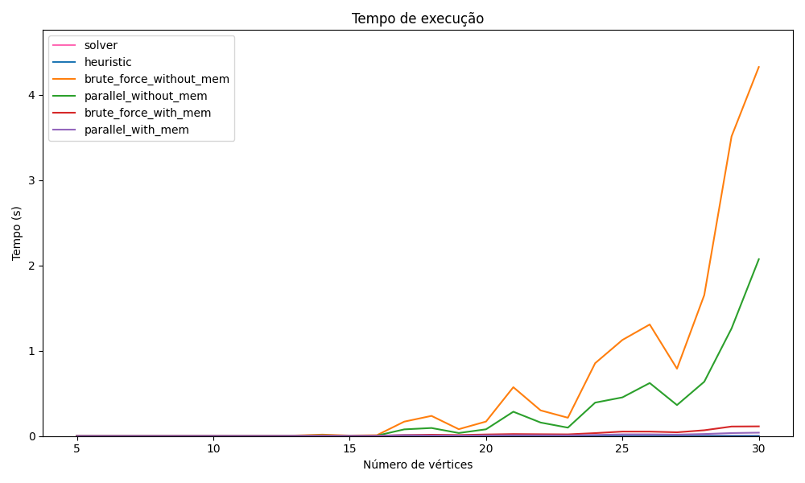
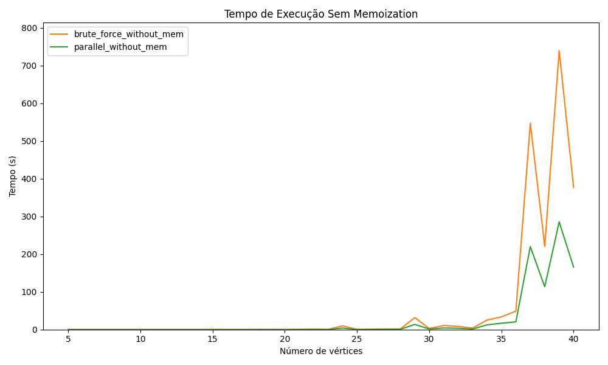
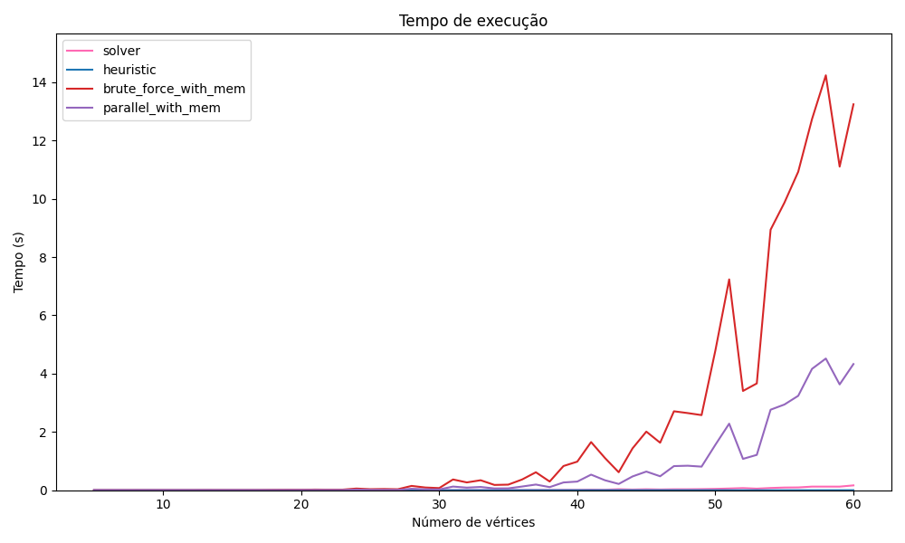
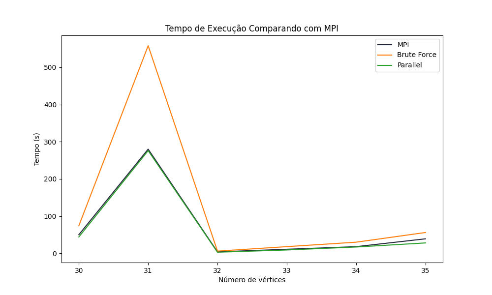

# Projeto Supercomp

**Eduardo Araujo Rodrigues da Cunha**


## Sobre o repositório

Este repositório foi criado para documentar e compartilhar a pesquisa e os desenvolvimentos feitos no contexto do Projeto Supercomp, focado em encontrar o maior clique em um grafo. Um clique é um subconjunto de vértices de um grafo não orientado, no qual cada par de vértices distintos é adjacente. Determinar o tamanho do maior clique é um problema NP-difícil e tem ampla aplicabilidade em áreas como ciências sociais, biologia, redes de computadores e outros.

## Hierarquia do repositório

**max_clique.py:** Arquivo principal do projeto, para gerar grafos a partir de diferentes implementações.

**clique.py:** Arquivo capaz de gerar um grafo aleatório e encontrar o maior clique deste grafo.

**/results:** Pasta com os resultados obtidos, na subpasta data estão os tempos de execução de cada implementação para o mesmo problemas, já na subpasta summaries estãp imagens que resumem os resultados obtidos, para diferentes problemas e implementações.

**/src:** Pasta com os códigos fonte das implementações.

**/executables:** Pasta com os executáveis das implementações, existe a versão para arquivos Linux e a versão para Windows.

**/mpi:** Pasta com os arquivos necessários para realizar as implementações com o MPI, arquivos *.slurm* usados no cluster, além dos inputs e outputs gerados.

## Diferentes implementações

Ao todo, foram feitas 6 implementações para buscar uma solução do problema, sendo elas:

**1. Força bruta sem memoização:** Implementação mais simples, que testa todas as possibilidades de cliques em um grafo, e retorna o maior clique encontrado.

**2. Força bruta com memoização:** Implementação que utiliza a técnica de memoização para evitar o retrabalho de testar cliques que já foram testados anteriormente.

**3. Heurística:** Solução a partir de uma heurística gulosa, em que prioriza vértices com maior grau de adjacência.

**4. Força bruta sem memoização paralelizada:** Mesma implementação da força bruta sem memoização, porém paralelizada utilizando a biblioteca OpenMP.

**5. Força bruta com memoização paralelizada:** Mesma implementação da força bruta com memoização, porém paralelizada utilizando a biblioteca OpenMP.

**6. MPI sem memoização ou paralelização:** Implementação que utiliza a biblioteca MPI para realizar a comunicação entre os processos, porém sem paralelização ou memoização.

**Observação:** Além delas, também, para critérios de validação e comparação, também esta presente a implementação da biblioteca networkx, que é capaz de encontrar o maior clique de um grafo.

## Como executar

Para executar, basta rodar o arquivo max_clique.py, ao final do arquivo, está declarado o objeto MaxClique com os seguintes argumentos:

```python
max_clique = MaxClique(vertices=range(5, 61, 1), linux=True, with_mem=True, without_mem=False)
```

Cada um deles é explicado abaixo:

**vertices:** Lista com os tamanhos dos grafos que serão gerados, por exemplo, se for passado range(5, 61, 1), serão gerados grafos de 5 a 60 vértices, com passo 1.

**linux:** Booleano que indica se o sistema operacional é Linux ou Windows, se for Linux, o executável a ser executado será o da pasta executables_linux, se for Windows, o executável a ser executado será o da pasta executables_windows.

**with_mem:** Booleano que indica se as implementações com memoização serão executadas.

**without_mem:** Booleano que indica se as implementações sem memoização serão executadas.

**save_graphs:** Booleano que indica se os grafos gerados serão salvos em um arquivo, normalmente, o arquivo de grafo gerado é sobrescrito pelo próximo gerado, isto impede isso, e possibilita guardar os grafos gerados.

### Importante

Lembre-se de alterar a variável Linux para True ou False, de acordo com o sistema operacional, ainda sim, é possível que os executáveis presentes estejam sem permissão de execução, para isso, basta executar o seguinte comando no terminal:

```bash
chmod +x executables_linux/*
```

## Resultados

Primeiramente, para confirmar os resultados das implementações, gerou-se 30 problemas, e comparou os resultados obtidos de cada implementação, com o resultado obtido pelo algoritmo da biblioteca networkx, que é capaz de encontrar o maior clique de um grafo. Os resultados obtidos podem ser vistos na imagem abaixo:


Confirmando-se os resultados, partiu-se para uma análise de tempo de cada implementação, primeiro, testou-se para 30 problemas, e os resultados obtidos podem ser vistos na imagem abaixo:



Assim, podemos validar as implementações, e comparar o tempo de execução de cada uma delas, para diferentes problemas, e os resultados obtidos podem ser vistos na imagem abaixo, porém antes, vale ressaltar que a implementação com heurística nem sempre encontra o máximo global, algo que é esperado, pois a heurística não garante a solução ótima, porém, em geral, a heurística encontra uma solução próxima do ótimo, e em um tempo muito menor.

Agora, comparando todas as implementações, temos as seguintes diferenças no tempo de execução:



Aqui, é perceptível que as implementações sem memoização são muito mais lentas que as implementações com memoização, e portanto, pode ser interessante separar a comparação de tempo de execução entre as implementações, para isso, gerou-se mais resultados, para problemas de 5 a 40 vértices, os resultados comparando as implementações sem memoização podem ser vistos abaixo:




Aqui é perceptível que a paralelização garantiu uma melhora de tempo, porém não muito significativa, por fim, resta comparar o tempo das implementações com memoização, para elas, gerou-se 60 problemas, e os resultados podem ser vistos abaixo:



Mais uma vez, o ganho de tempo com a paralelização não foi muito significativo, porém, em relação as implementações, estas são bem mais rápidas.

Por fim, resta comparar o tempo de execução da implementação com o MPI, para isso, utilizou-se um cluster com 2 nós, cada um com 4 CPUs, para comparar fielmente com as implementações anteriores, todas elas foram rodadas no cluster utilizado, de forma que elas extrairam todos os recursos de um único nó, já a implementação com MPI, foi rodada em 2 nós, de forma que ela extraiu todos os recursos de 2 nós, os resultados podem ser vistos abaixo:

**Importante:** Todas implementações foram executadas usando um arquivo .slurm, encontrados no diretório MPI, finalizando, o tempo foi recolhido manualmente através do seguinte:

`scontrol show job <id_do_job>`

Assim, foi possível encontrar o tempo de execução de cada job, anota-los, e comparar com os resultados obtidos pelas outras implementações.



Aqui, percebe-se que o MPI aprensentou um tempo melhor do que a solução de força bruta, porém ficou com tempos parecidos com a paralelização. Comparar o MPI com a paralelização não é trivial, uma vez que ambos são dependentes do Hardware utilizado, dificultando a comparação, de qualquer forma, ambos são melhores que uma implementação de força bruta simples.

Enfim, finaliza-se aqui o projeto de desenvolver soluções para a busca do maior clique em um grafo, e comparar o tempo de execução de cada uma delas, para diferentes problemas, e diferentes implementações.