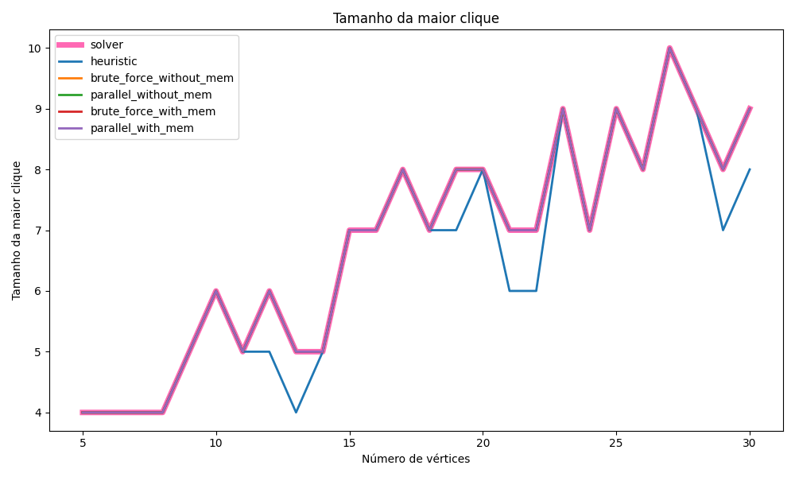
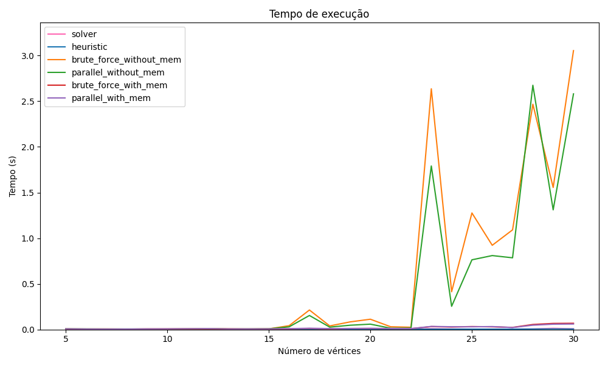
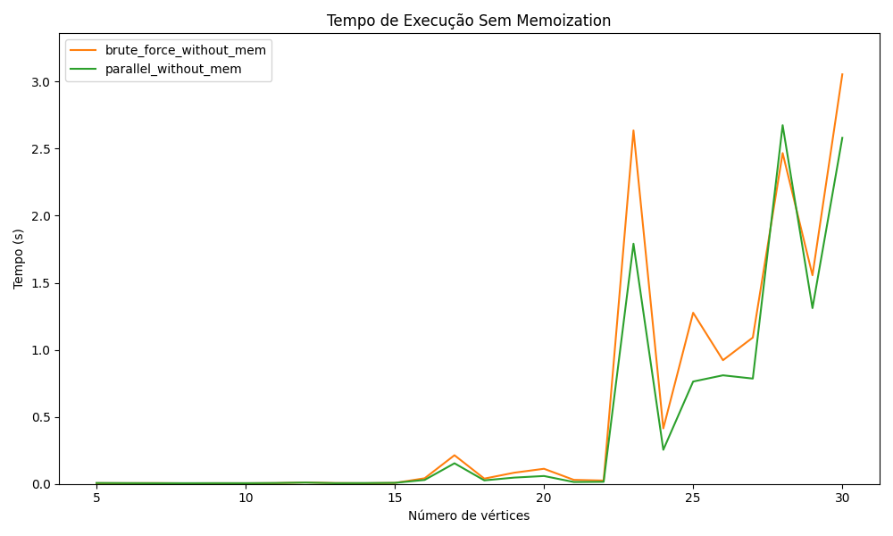
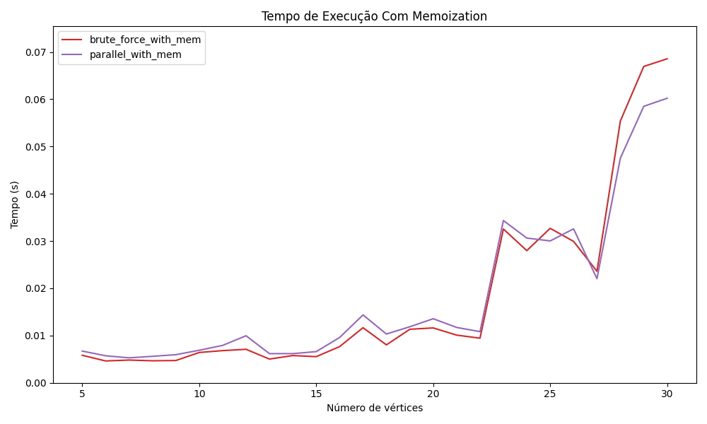

# Projeto Supercomp

**Eduardo Araujo Rodrigues da Cunha**

## Sobre o repositório

Este repositório foi criado para documentar e compartilhar a pesquisa e os desenvolvimentos feitos no contexto do Projeto Supercomp, focado em encontrar o maior clique em um grafo. Um clique é um subconjunto de vértices de um grafo não orientado, no qual cada par de vértices distintos é adjacente. Determinar o tamanho do maior clique é um problema NP-difícil e tem ampla aplicabilidade em áreas como ciências sociais, biologia, redes de computadores e outros.

## Hierarquia do repositório

**max_clique.py:** Arquivo principal do projeto, para gerar grafos a partir de diferentes implementações.

**clique.py:** Arquivo capaz de gerar um grafo aleatório e encontrar o maior clique deste grafo.

**/results:** Pasta com os resultados obtidos, na subpasta data estão os tempos de execução de cada implementação para o mesmo problemas, já na subpasta summaries estãp imagens que resumem os resultados obtidos, para diferentes problemas e implementações.

**/src:** Pasta com os códigos fonte das implementações.

**/executables:** Pasta com os executáveis das implementações, existe a versão para arquivos Linux e a versão para Windows.

## Diferentes implementações

Ao todo, foram feitas 5 implementações para buscar uma solução do problema, sendo elas:

**1. Força bruta sem memoização:** Implementação mais simples, que testa todas as possibilidades de cliques em um grafo, e retorna o maior clique encontrado.

**2. Força bruta com memoização:** Implementação que utiliza a técnica de memoização para evitar o retrabalho de testar cliques que já foram testados anteriormente.

**3. Heurística:** Solução a partir de uma heurística gulosa, em que prioriza vértices com maior grau de adjacência.

**4. Força bruta sem memoização paralelizada:** Mesma implementação da força bruta sem memoização, porém paralelizada utilizando a biblioteca OpenMP.

**5. Força bruta com memoização paralelizada:** Mesma implementação da força bruta com memoização, porém paralelizada utilizando a biblioteca OpenMP.

## Resultados

Primeiramente, para confirmar os resultados das implementações, gerou-se 50 problemas, e comparou os resultados obtidos de cada implementação, com o resultado obtido por um algoritmo da biblioteca networkx, que é capaz de encontrar o maior clique de um grafo. Os resultados obtidos podem ser vistos na imagem abaixo:

Confirmando-se os resultados, partiu-se para uma análise de tempo de cada implementação, primeiro, testou-se para 30 problemas, e os resultados obtidos podem ser vistos na imagem abaixo:

Assim, podemos validar as implementações, e comparar o tempo de execução de cada uma delas, para diferentes problemas, e os resultados obtidos podem ser vistos na imagem abaixo, porém antes, vale ressaltar que a implementação com heurística nem sempre encontra o máximo global, algo que é esperado, pois a heurística não garante a solução ótima, porém, em geral, a heurística encontra uma solução próxima do ótimo, e em um tempo muito menor.

Agora, comparando todas as implementações, temos as seguintes diferenças no tempo de execução:

Aqui, é perceptível que as implementações sem memoização são muito mais lentas que as implementações com memoização, e portanto, pode ser interessante separar a comparação de tempo de execução entre as implementações com memoização, e as implementações sem memoização, e os resultados obtidos podem ser vistos nas imagens abaixo:

